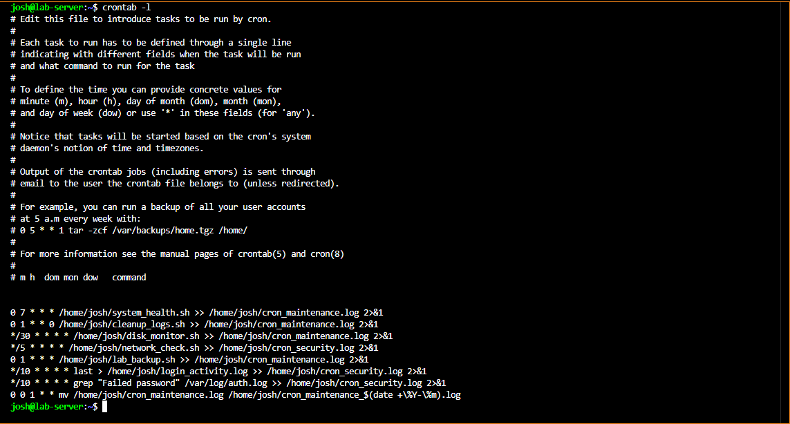

# Cron Automation and Maintenance

## Overview

Cron was used to automate routine system maintenance tasks on the Dell Laptop (Debian 12 server). Rather than running checks manually, cron schedules scripts to run automatically and log their output for review.

---

## Scheduled Jobs

The cron jobs were configured using:

```bash
crontab -e
```

Current crontab:



```
0 7 * * *   /home/josh/system_health.sh       >> /home/josh/cron_maintenance.log 2>&1
0 1 * * 0   /home/josh/cleanup_logs.sh        >> /home/josh/cron_maintenance.log 2>&1
*/30 * * * * /home/josh/disk_monitor.sh       >> /home/josh/cron_maintenance.log 2>&1
*/5 * * * *  /home/josh/network_check.sh      >> /home/josh/cron_security.log 2>&1
0 1 * * *   /home/josh/lab_backup.sh          >> /home/josh/cron_maintenance.log 2>&1
*/10 * * * * last > /home/josh/login_activity.log >> /home/josh/cron_security.log 2>&1
*/10 * * * * grep "Failed password" /var/log/auth.log >> /home/josh/cron_security.log 2>&1
0 0 1 * *   mv /home/josh/cron_maintenance.log /home/josh/cron_maintenance_$(date +\%Y-\%m).log
```

---

## What Each Job Does

| Schedule        | Script                | Purpose                                            |
| --------------- | --------------------- | -------------------------------------------------- |
| Daily at 7am    | `system_health.sh`    | Records system uptime, memory, and disk usage      |
| Weekly (Sun 1am)| `cleanup_logs.sh`     | Removes old log files to prevent disk bloat        |
| Every 30 min    | `disk_monitor.sh`     | Checks disk usage and logs warnings if high        |
| Every 5 min     | `network_check.sh`    | Checks connectivity and logs results               |
| Daily at 1am    | `lab_backup.sh`       | Backs up key config files to a backup location     |
| Every 10 min    | `last` command        | Logs recent login activity                         |
| Every 10 min    | `grep` on auth.log    | Captures failed password attempts to security log  |
| Monthly         | Log rotation          | Archives the maintenance log with a date stamp     |

---

## Log Files

| Log File                      | Contents                            |
| ----------------------------- | ----------------------------------- |
| `cron_maintenance.log`        | Output from health, disk, backup jobs |
| `cron_security.log`           | Failed logins and network checks    |
| `cron_maintenance_YYYY-MM.log`| Monthly archived maintenance logs   |

Separating maintenance and security logs makes it easier to review each independently.

---

## Lessons Learned

- Redirecting both stdout and stderr (`2>&1`) is essential — silent failures are hard to debug
- Monthly log rotation prevents a single file from growing indefinitely
- Having cron monitor `auth.log` for failed passwords adds a lightweight manual audit layer on top of Fail2Ban
