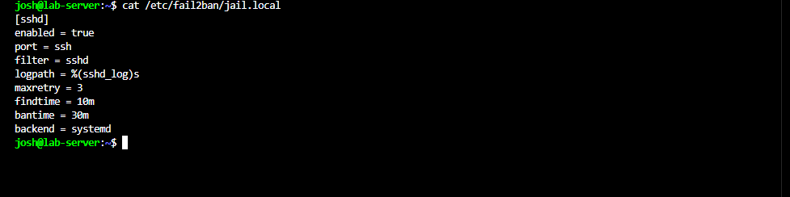
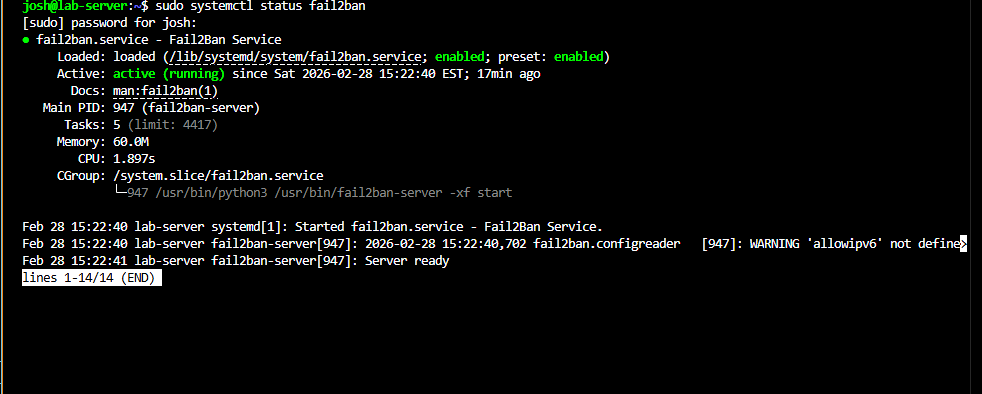
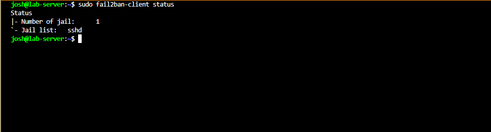
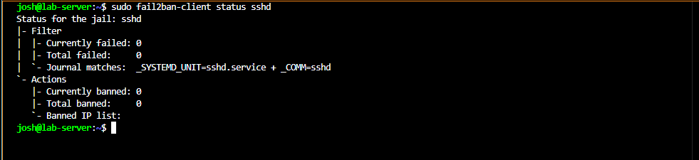
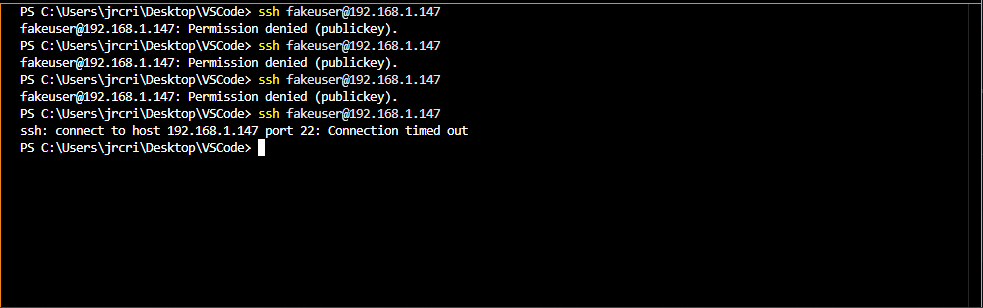

# Fail2Ban Intrusion Prevention

## Overview

Fail2Ban was configured on the Dell Laptop (Debian 12 server) as the third layer of SSH protection, alongside key-based authentication and UFW. It monitors authentication logs and automatically bans IP addresses that exceed a defined number of failed login attempts.

---

## Installation

```bash
sudo apt update
sudo apt install fail2ban
```

Fail2Ban starts automatically after installation.

---

## Configuration

Rather than editing `jail.conf` directly, a local override file was created:

```bash
sudo nano /etc/fail2ban/jail.local
```

Configuration as applied:



```ini
[sshd]
enabled = true
port = ssh
filter = sshd
logpath = %(sshd_log)s
maxretry = 3
findtime = 10m
bantime = 30m
backend = systemd
```

| Setting     | Meaning                                              |
| ----------- | ---------------------------------------------------- |
| `maxretry`  | Failed attempts before a ban is triggered            |
| `findtime`  | Time window in which failures are counted            |
| `bantime`   | How long the IP is blocked                           |
| `backend`   | Log source — `systemd` for modern Debian/Ubuntu      |

After saving, the service was restarted:

```bash
sudo systemctl restart fail2ban
```

---

## Verifying Fail2Ban is Running

```bash
sudo systemctl status fail2ban
```



---

## Checking Active Jails

```bash
sudo fail2ban-client status
```



To inspect the SSH jail specifically:

```bash
sudo fail2ban-client status sshd
```

---

## Simulating an Attack

Multiple failed SSH login attempts were generated from the HP Laptop to trigger a ban:

```powershell
ssh fakeuser@192.168.1.147
```

Before the ban triggered, repeated failures were visible in the logs:



After enough failures, Fail2Ban blocked the IP automatically:



---

## Unbanning an IP

If a legitimate user is accidentally banned:

```bash
sudo fail2ban-client set sshd unbanip <IP_ADDRESS>
```

---

## Lessons Learned

- Setting `backend = systemd` is important on modern distros — `auto` can default incorrectly
- Fail2Ban, UFW, and SSH hardening together form a solid layered defense
- Live testing the ban behavior (watching it happen in real time) is the best way to confirm the configuration is actually working
