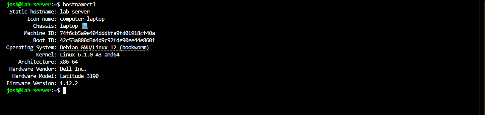
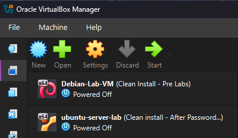

# Lab Architecture

## Overview

This document describes the physical hardware, virtual machines, and network layout of the home lab. For a high-level project summary, see the [README](../README.md).

---

## Physical Machines

### Dell Laptop — Primary Hardened Server

- **OS:** Debian 12 (bare metal, not a VM)
- **IP:** 192.168.1.147
- **Role:** The core lab server where all major security configurations were applied

Tasks performed on this machine:

- Multi-user SSH access and key authentication
- SSH hardening (`sshd_config`)
- Firewall configuration (UFW)
- Intrusion prevention (Fail2Ban)
- Log analysis and monitoring
- Cron automation and maintenance scripts

System identity confirmed with `hostnamectl`:



---

### HP Laptop — Main SSH Client

- **OS:** Windows
- **Role:** Primary client machine used to SSH into the Dell Laptop server

Used for:

- Generating ed25519 SSH key pairs
- Remote administration via the Windows OpenSSH client
- Testing authentication behavior from a real separate machine

---

### Dell Desktop — Virtualization Host

- **OS:** Windows
- **Role:** Hosts two virtual machines used for passwordless SSH practice and experimental testing

The Dell Desktop itself is not hardened or configured as a server — it is purely a VirtualBox host.



---

## Virtual Machines (hosted on Dell Desktop)

Both VMs were used to practice passwordless SSH authentication and to run experiments safely without touching the main hardened server.

### Debian VM

- Used to practice SSH key setup and passwordless login
- Secondary environment for safe configuration testing

### Ubuntu Server VM — `192.168.1.122`

- Used alongside the Debian VM to practice multi-host SSH administration
- Allowed comparison of behavior between Debian and Ubuntu

See [Ubuntu Server Setup](ubuntu-server-setup.md) for configuration details.

---

## SSH Access Model

All client machines authenticate using **ed25519 SSH key pairs** — no password authentication.

Public keys are stored on each server in:

```
~/.ssh/authorized_keys
```

Required permissions:

```
~/.ssh                 → 700
~/.ssh/authorized_keys → 600
```

SSH config files on the HP Laptop client simplify connecting to multiple hosts without specifying the key manually each time. See [SSH Passwordless Authentication](ssh-passwordless-authentication.md) for setup details.

---

## User Accounts

Multiple users were created on the Dell Laptop (Debian 12 server) to simulate a real multi-user environment. Each user has their own SSH key. See [User Management](user-management-and-ssh-access.md) for details.
