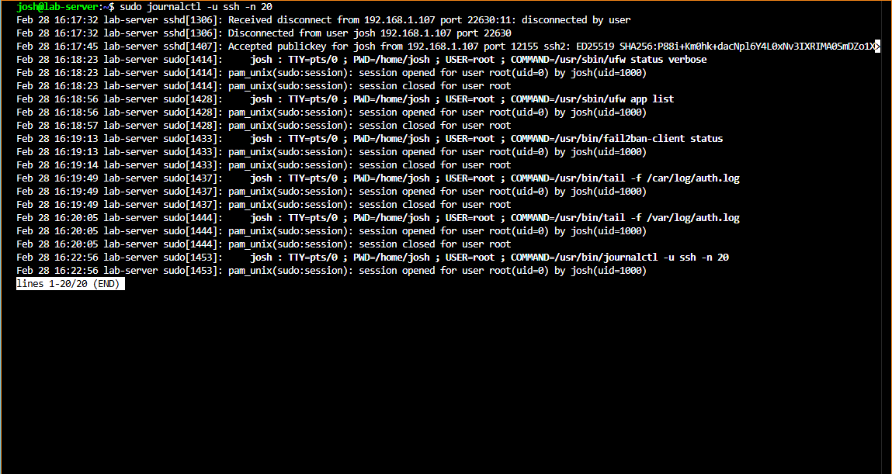

# Log Analysis and Monitoring

## Overview

Log monitoring is one of the most important responsibilities of a Linux system administrator. In this lab, logs on the Dell Laptop were used to investigate SSH login behavior, verify security tool activity, and observe system events in real time.

---

## Common Log Locations

Linux stores logs in `/var/log`. Key files used in this lab:

| Log File   | Purpose                                          |
| ---------- | ------------------------------------------------ |
| `auth.log` | Authentication events — SSH logins, sudo usage   |
| `syslog`   | General system messages                          |
| `kern.log` | Kernel-related messages                          |
| `dmesg`    | Hardware and boot messages                       |

> Log file names can vary between distributions. Ubuntu and Debian typically use `auth.log` for authentication events.

---

## Viewing Authentication Logs

```bash
sudo cat /var/log/auth.log
```

Example of a successful key-based login:

```
Accepted publickey for josh from 192.168.1.107 port 22630 ssh2: ED25519 SHA256:...
```

---

## Real-Time Monitoring

```bash
sudo tail -f /var/log/auth.log
```

This streams new log entries as they are written — useful when testing login behavior or watching Fail2Ban in action.

---

## Using journalctl

On systemd-based systems, logs are also available through the journal:

```bash
sudo journalctl -u ssh -n 20
```

This shows the last 20 SSH-related log entries. Real output from the lab:



The journal shows accepted logins, disconnections, sudo commands run, and the services accessed during the session.

---

## Detecting Failed Login Attempts

```bash
grep "Failed password" /var/log/auth.log
```

Example entry:

```
Failed password for invalid user admin from 192.168.1.55 port 40322 ssh2
```

Repeated entries from the same IP indicate a brute-force attempt. This is exactly what Fail2Ban monitors and responds to automatically.

---

## Monitoring Fail2Ban Activity

```bash
sudo fail2ban-client status sshd
```

This shows currently banned IPs, total bans, and the number of failures detected. See [Fail2Ban Intrusion Prevention](fail2ban-intrusion-prevention.md) for details.

---

## Lessons Learned

- `journalctl -u ssh` is often more readable than raw `auth.log` on modern systems
- Real-time monitoring with `tail -f` is the fastest way to confirm a configuration change is working
- Logs are the first place to look when something unexpected happens — developing the habit of reading them is as important as the tooling itself
