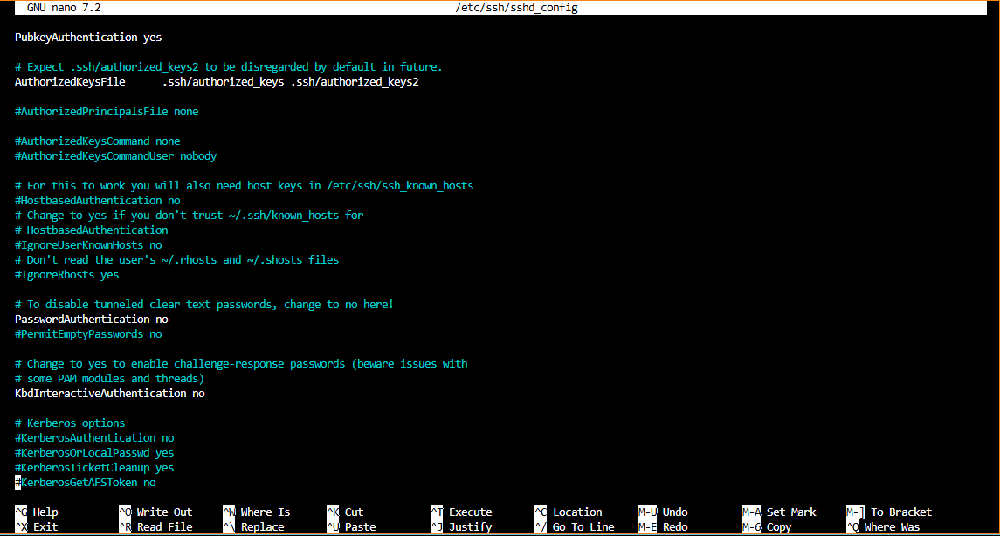
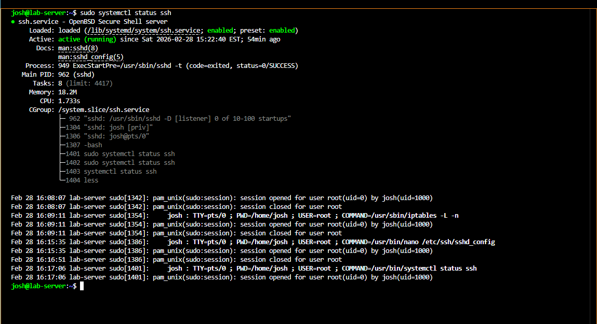
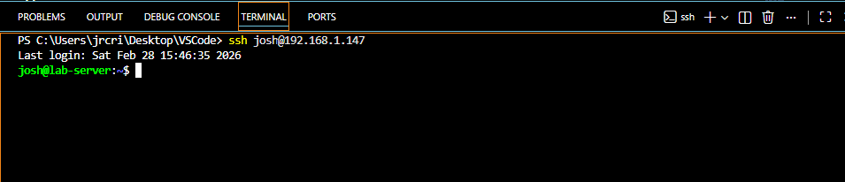

# SSH Hardening

## Overview

After confirming key-based authentication was working, the SSH service was hardened to reduce the server's attack surface. These settings were applied to `/etc/ssh/sshd_config` on the Dell Laptop (Debian 12 server).

---

## Configuration Changes

The config file was edited with:

```bash
sudo nano /etc/ssh/sshd_config
```

Key settings applied:

```
PermitRootLogin no
PasswordAuthentication no
KbdInteractiveAuthentication no
AllowUsers josh carrie alex
```

> **Note:** `KbdInteractiveAuthentication` replaces the deprecated `ChallengeResponseAuthentication` directive in OpenSSH 9.x and later.

Configuration as applied in the editor:



---

## Validating and Restarting

Before restarting, the configuration was tested for syntax errors:

```bash
sudo sshd -t
```

The SSH service was then restarted:

```bash
sudo systemctl restart ssh
```

Service confirmed running:



---

## What Each Setting Does

| Setting                           | Effect                                                              |
| --------------------------------- | ------------------------------------------------------------------- |
| `PermitRootLogin no`              | Forces use of a regular account; root must use sudo                 |
| `PasswordAuthentication no`       | Disables password logins; key auth only                             |
| `KbdInteractiveAuthentication no` | Disables alternative keyboard-interactive auth methods              |
| `AllowUsers josh carrie alex`     | Restricts SSH access to listed users only                           |

---

## Testing After Hardening

SSH access was tested from the client after each change to confirm authorized users could still connect and that password auth was rejected.

Successful connection:



Clean disconnect:


---

## Lessons Learned

- Always run `sudo sshd -t` before restarting — a config error can lock you out
- Test from a second terminal session before closing the first after applying changes
- `AllowUsers` is an easy way to limit exposure without complex PAM configuration
