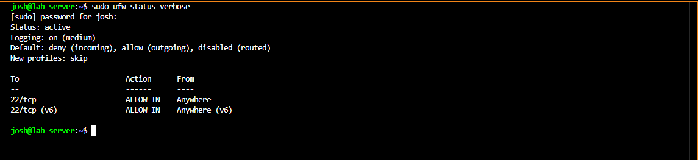
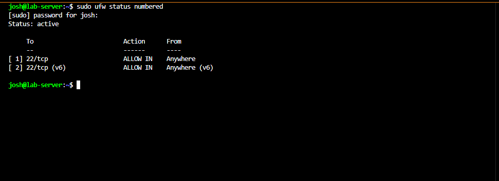

# UFW Firewall Configuration

## Overview

UFW (Uncomplicated Firewall) was configured on the Dell Laptop (Debian 12 server) to block all unsolicited inbound connections while allowing SSH administration. UFW provides a simplified interface for managing the underlying `iptables` rules.

---

## Default Policies

Before enabling the firewall, default traffic policies were set:

```bash
sudo ufw default deny incoming
sudo ufw default allow outgoing
```

This creates a secure baseline — nothing gets in unless explicitly allowed.

---

## Allowing SSH

SSH must be allowed **before** enabling the firewall to avoid locking out remote access:

```bash
sudo ufw allow ssh
```

This is equivalent to:

```bash
sudo ufw allow 22/tcp
```

---

## Enabling the Firewall

```bash
sudo ufw enable
```

UFW warns that enabling may interrupt existing SSH connections. Since SSH was allowed first, this is not a concern.

---

## Verifying the Rules

```bash
sudo ufw status verbose
```



Numbered rule view:

```bash
sudo ufw status numbered
```



Both IPv4 and IPv6 SSH access are permitted. All other inbound traffic is blocked by default.

---

## Additional Commands

```bash
sudo ufw status numbered        # view rules with index numbers
sudo ufw delete <rule_number>   # remove a rule by number
sudo ufw disable                # temporarily disable (for troubleshooting)
```

---

## Lessons Learned

- Always allow SSH before enabling UFW — order matters
- `ufw status verbose` gives more detail than `ufw status` alone
- UFW integrates cleanly with Fail2Ban, which manages its own ban rules on top of UFW
